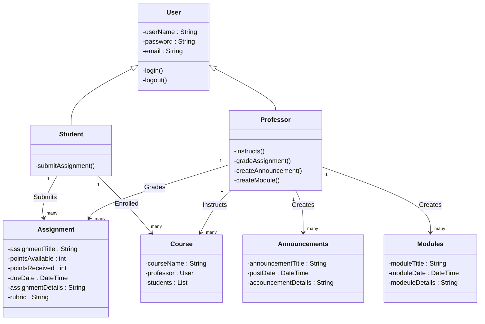

```mermaid
classDiagram
    User <|-- Student
    User <|-- Professor

    class Course {
        -courseName : String
        -professor : User
        -students : List <Student>
    }

    class User {
        -userName : String
        -password : String
        -email : String
        -login()
        -logout()
    }

    class Professor {
        -instructs()
        -gradeAssignment()
        -createAnnouncement()
        -createModule()
    }

    class Student {
        -submitAssignment()
    }

    class Assignment {
        -assignmentTitle : String
        -pointsAvailable : int
        -pointsReceived : int
        -dueDate : DateTime
        -assignmentDetails : String
        -rubric : String
    }

    class Announcements {
        -announcementTitle : String
        -postDate : DateTime
        -accouncementDetails : String
    }

    class Modules {
        -moduleTitle : String
        -moduleDate : DateTime
        -modeuleDetails : String
    }

    Student "1" --> "many" Assignment : Submits
    Student "1" --> "many" Course : Enrolled
    Professor "1" --> "many" Assignment : Grades
    Professor "1" --> "many" Course : Instructs
    Professor "1" --> "many" Announcements : Creates
    Professor "1" --> "many" Modules : Creates

```
